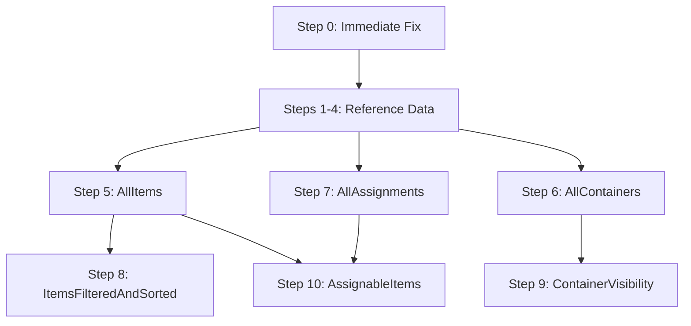

# Async Provider Migration Plan

This document outlines the complete migration plan to move from dual provider patterns to a unified async provider pattern in RescuenetWarehouse.

## Migration Overview

**Goal**: Migrate all dual provider patterns to use only async providers (`AsyncValue<T>`) for consistent loading states and better error handling.

**Strategy**: Provider-by-provider migration with clear use cases and dependencies.

## Migration Steps - By Provider Pattern

Each step below can be executed independently, but should follow the dependency order listed.

## Step 0: Immediate Fix for Loading Issues 🚨 **CRITICAL**

**Problem**: ItemOverview and other pages show infinite loading
**Root Cause**: Eager initialization uses sync providers, but UI uses async providers

### 0.1 Fix Eager Initialization
**File**: `lib/main.dart` (lines 123-127)

**Change these lines:**
```dart
// BEFORE (causes infinite loading)
ref.watch(allItemsNotifierProvider);           // sync
ref.watch(allAssignmentsNotifierProvider);     // sync  
ref.watch(itemsFilteredAndSortedNotifierProvider); // sync

// AFTER (fixes loading)
ref.watch(allItemsAsyncProvider);              // async
ref.watch(allAssignmentsAsyncProvider);        // async
ref.watch(itemsFilteredAndSortedAsyncProvider); // async
```

**Impact**: Fixes immediate loading issues in ItemOverview, ContainerOverview, etc.
**Risk**: Low - just switches to existing async providers
**Test**: Verify ItemOverview loads items correctly

---

## Step 1: ContainerTypes Provider Migration 📦

**Current State**: Only sync version exists
**Goal**: Create async version and migrate all usage

### 1.1 Create Async Provider
**File**: `lib/state/container_types_notifier.dart`

**Add this class:**
```dart
@riverpod
class ContainerTypesAsync extends _$ContainerTypesAsync {
  @override
  Stream<List<ContainerType>> build() {
    final repository = ref.watch(containerTypeRepositoryProvider);
    return repository.watchContainerTypes();
  }
}
```

### 1.2 Update UI Components
**Files that use `containerTypesNotifierProvider`:**
- `lib/ui/container_edit_page/container_edit_page_type.dart`
- `lib/ui/edit_custom_values/edit_container_types.dart`
- Any dropdowns showing container types

**Change**: Wrap with `AsyncValueBuilder<List<ContainerType>>`

### 1.3 Update Eager Initialization
**File**: `lib/main.dart` (line 119)
```dart
// BEFORE
ref.watch(containerTypesNotifierProvider);

// AFTER  
ref.watch(containerTypesAsyncProvider);
```

### 1.4 Remove Sync Provider
**After confirming no usage**: Remove `ContainerTypesNotifier` class

---

## Step 2: CurrentLocations Provider Migration 📍

**Current State**: Only sync version exists
**Goal**: Create async version and migrate all usage

### 2.1 Create Async Provider
**File**: `lib/state/current_locations_notifier.dart`

**Add this class:**
```dart
@riverpod
class CurrentLocationsAsync extends _$CurrentLocationsAsync {
  @override
  Stream<List<CurrentLocation>> build() {
    final repository = ref.watch(currentLocationRepositoryProvider);
    return repository.watchCurrentLocations();
  }
}
```

### 2.2 Update UI Components
**Files that use `currentLocationsNotifierProvider`:**
- `lib/ui/container_edit_page/container_edit_page_current_location.dart`
- `lib/ui/edit_custom_values/edit_current_locations.dart`
- Any dropdowns showing current locations

### 2.3 Update Usage Tracking
**File**: `lib/state/current_location_usage_notifier.dart`
**Change**: Use `allContainersAsyncProvider` instead of sync version

### 2.4 Update Eager Initialization
**File**: `lib/main.dart` (line 121)
```dart
// BEFORE
ref.watch(currentLocationsNotifierProvider);

// AFTER
ref.watch(currentLocationsAsyncProvider);
```

---

## Step 3: ModuleDestinations Provider Migration 🎯

**Current State**: Only sync version exists
**Goal**: Create async version and migrate all usage

### 3.1 Create Async Provider
**File**: `lib/state/module_destinations_notifier.dart`

**Add this class:**
```dart
@riverpod
class ModuleDestinationsAsync extends _$ModuleDestinationsAsync {
  @override
  Stream<List<ModuleDestination>> build() {
    final repository = ref.watch(moduleDestinationRepositoryProvider);
    return repository.watchModuleDestinations();
  }
}
```

### 3.2 Update UI Components
**Files that use `moduleDestinationsNotifierProvider`:**
- `lib/ui/container_edit_page/container_edit_page_module_destination.dart`
- `lib/ui/edit_custom_values/edit_module_destinations.dart`
- Any dropdowns showing module destinations

### 3.3 Update Usage Tracking
**File**: `lib/state/module_destination_usage_notifier.dart`
**Change**: Use `allContainersAsyncProvider` instead of sync version

### 3.4 Update Eager Initialization
**File**: `lib/main.dart` (line 120)
```dart
// BEFORE
ref.watch(moduleDestinationsNotifierProvider);

// AFTER
ref.watch(moduleDestinationsAsyncProvider);
```

---

## Step 4: AllWorkLogs Provider Migration 📝

**Current State**: Only sync version exists
**Goal**: Create async version and migrate work log page

### 4.1 Create Async Provider
**File**: `lib/state/all_work_logs_notifier.dart`

**Add this class:**
```dart
@riverpod
class AllWorkLogsAsync extends _$AllWorkLogsAsync {
  @override
  Stream<List<WorkLog>> build() {
    final repository = ref.watch(workLogRepositoryProvider);
    return repository.watchWorkLogs();
  }
}
```

### 4.2 Update Work Log Page
**File**: `lib/ui/work_log_page/work_log_page.dart`
**Change**: `allWorkLogsNotifierProvider` → `allWorkLogsAsyncProvider`
**Add**: `AsyncValueBuilder<List<WorkLog>>` wrapper for loading states

### 4.3 Add to Eager Initialization (if needed)
**File**: `lib/main.dart`
**Consider adding**: `ref.watch(allWorkLogsAsyncProvider);`

---

## Step 5: AllItems Provider Migration 📋

**Current State**: Dual pattern exists (sync + async)
**Goal**: Migrate all sync usage to async, remove sync provider

### 5.1 Update Dependent State Notifiers
**Files to modify:**
- `lib/state/current_item_notifier.dart` - use `allItemsAsyncProvider`
- `lib/state/container_with_items_notifier.dart` - use `allItemsAsyncProvider`
- `lib/state/assignable_items_notifier.dart` - use `allItemsAsyncProvider`

**Pattern**: Convert to async pattern using `.when()` or watching async provider

### 5.2 Update UI Components
**Files using `allItemsNotifierProvider`:**
- Search for direct usage and convert to `allItemsAsyncProvider`
- Wrap with `AsyncValueBuilder<List<Item>>`

### 5.3 Update Eager Initialization
**File**: `lib/main.dart` (line 123) - Already done in Step 0

### 5.4 Remove Sync Provider
**File**: `lib/state/all_items_notifier.dart`
**Remove**: `AllItemsNotifier` class and `allItemsNotifierProvider`
**Keep**: `AllItemsAsync` and backward compatibility stream provider

---

## Step 6: AllContainers Provider Migration 📦

**Current State**: Dual pattern exists (sync + async)
**Goal**: Migrate all sync usage to async, remove sync provider

### 6.1 Update Dependent State Notifiers
**Files to modify:**
- `lib/state/container_with_items_notifier.dart` - use `allContainersAsyncProvider`
- `lib/state/container_visibility_notifier.dart` - use `allContainersAsyncProvider`
- Usage tracking notifiers (Step 2.3, 3.3 dependencies)

### 6.2 Update UI Components
**Files using `allContainersNotifierProvider`:**
- Container selection components
- Container management pages

### 6.3 Update Eager Initialization
**File**: `lib/main.dart` (line 122)
```dart
// BEFORE
ref.watch(allContainersNotifierProvider);

// AFTER
ref.watch(allContainersAsyncProvider);
```

### 6.4 Remove Sync Provider
**Remove**: `AllContainersNotifier` class and provider

---

## Step 7: AllAssignments Provider Migration 🔗

**Current State**: Dual pattern exists (sync + async)
**Goal**: Migrate all sync usage to async, remove sync provider

### 7.1 Update Dependent State Notifiers
**Files to modify:**
- `lib/state/current_item_assignments_notifier.dart` - use `allAssignmentsAsyncProvider`
- `lib/state/container_with_items_notifier.dart` - use `allAssignmentsAsyncProvider`
- `lib/state/assignable_items_notifier.dart` - use `allAssignmentsAsyncProvider`

### 7.2 Update UI Components
**Files using `allAssignmentsNotifierProvider`:**
- Assignment management components
- Container content views

### 7.3 Update Eager Initialization
**File**: `lib/main.dart` (line 124) - Already done in Step 0

### 7.4 Remove Sync Provider
**Remove**: `AllAssignmentsNotifier` class and provider

---

## Step 8: ItemsFilteredAndSorted Provider Migration 🔍

**Current State**: Dual pattern exists (sync + async), UI already uses async
**Goal**: Remove sync provider, update any remaining sync usage

### 8.1 Verify No Sync Usage
**Search codebase**: Confirm no components use `itemsFilteredAndSortedNotifierProvider`

### 8.2 Update Eager Initialization
**File**: `lib/main.dart` (line 127) - Already done in Step 0

### 8.3 Remove Sync Provider
**File**: `lib/state/items_filtered_and_sorted_notifier.dart`
**Remove**: `ItemsFilteredAndSortedNotifier` class and provider
**Keep**: `ItemsFilteredAndSortedAsync` and backward compatibility provider

---

## Step 9: ContainerVisibility Provider Migration 👁️

**Current State**: Dual pattern exists (sync + async)
**Goal**: Migrate all sync usage to async, remove sync provider

### 9.1 Update UI Components
**Files using `containerVisibilityNotifierProvider`:**
- Container overview pages already use async version
- Check for any remaining sync usage

### 9.2 Update Eager Initialization
**File**: `lib/main.dart` (line 129)
```dart
// BEFORE
ref.watch(containerVisibilityNotifierProvider);

// AFTER
ref.watch(containerVisibilityAsyncProvider);
```

### 9.3 Remove Sync Provider
**Remove**: `ContainerVisibilityNotifier` class and provider

---

## Step 10: AssignableItems Provider Migration ⚖️

**Current State**: Dual pattern exists (sync + async)
**Goal**: Migrate all sync usage to async, remove sync provider

### 10.1 Update Usage
**Files using `assignableItemsNotifierProvider`:**
- Assignment workflow components
- Item selection components

### 10.2 No Eager Initialization
**Note**: This provider is not eagerly initialized currently

### 10.3 Remove Sync Provider
**Remove**: `AssignableItemsNotifier` class and provider

---

## Execution Strategy

### Recommended Order
1. **Step 0** 🚨 - **START HERE** - Fixes immediate loading issues
2. **Steps 1-4** 📦📍🎯📝 - Reference data (can be done in parallel)
3. **Steps 5-7** 📋📦🔗 - Core data (follow dependency order)
4. **Steps 8-10** 🔍👁️⚖️ - Derived data (final cleanup)

### For Each Step:
1. **Implement** the changes described
2. **Test** that the specific provider works
3. **Run code generation**: `dart run build_runner build`
4. **Verify** no regressions in related components

### Testing After Each Step
- **Manual**: Navigate to pages that use the migrated provider
- **Loading States**: Verify loading indicators work properly
- **Data Display**: Confirm data loads and displays correctly
- **Error Handling**: Test with network disconnected

## Dependencies Between Steps



## Success Criteria Per Step

### Step 0 Success ✅
- ItemOverview page loads items (no infinite loading)
- ContainerOverview page loads containers
- No console errors about provider initialization

### Steps 1-4 Success ✅ 
- Dropdown menus populate with reference data
- Edit pages load without errors
- Loading states appear briefly then show data

### Steps 5-7 Success ✅
- All data-dependent components work correctly
- No sync provider usage remains
- Loading states consistent across app

### Steps 8-10 Success ✅
- All derived data providers work with async sources
- Code complexity reduced
- No dual provider patterns remain

## Rollback Plan

If any step causes issues:
1. **Keep both providers** temporarily
2. **Revert eager initialization** to sync version
3. **Fix issues** before continuing
4. **Re-run code generation** if needed

Each step is designed to be **reversible** until the final cleanup phases.